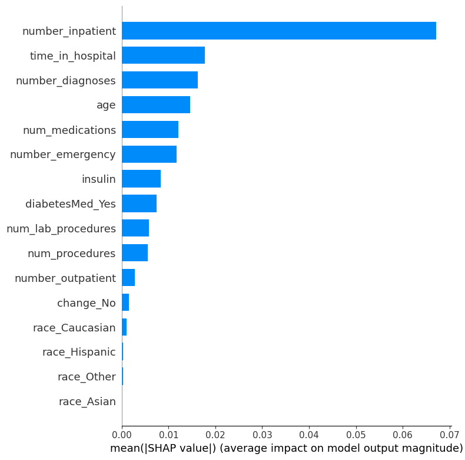
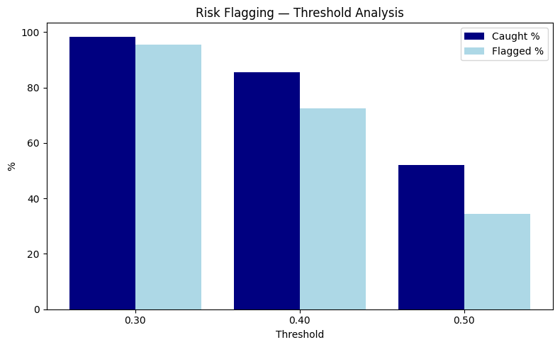

# Diabetes Hospital Readmission Analysis 
### Healthcare Analytics | Predictive Modeling | Risk Flagging

## Executive Summary
11% of diabetic patients across 130 US hospitals are readmitted within 30 days of discharge - resulting in financial penalties for hospitals under the Hospital Readmissions Reduction Program (HRRP). Using SQL data exploration in Databricks and a tuned Random Forest model, this analysis identifies the clinical drivers of early readmission and develops a flagging system that catches 85% of actual readmissions at a 0.40 probability threshold. 

Prior inpatient visits is revealed as the dominant driver in early readmission rates - 5.5x increase from 0 to 8+ prior admissions. The model achieves a 64% AUC, not clinically reliable to drive absolute decisions - rather sufficient enough to be used as a tool in providing flagged profiles enhanced discharged planning. Further data - post-discharge follow ups and patient compliance is necessary to boost model performance for clinical deployment.  

## Business Problem
Hospitals face direct financial penalties for excessive 30-day readmissions under HRRP. Additionally, for diabetic patients - considered as high-risk profiles of serious long term health complications - early readmission suggest a failure in discharge planning, treatment, or follow-up care. The key issue is identifying which patients are most likely to return prior to discharge, while intervention is still possible.

This is a precedent issue as clinical staff juggle between heavy caseloads leading to rushed discharge planning, shortage of staff, or poor communication from clinicians to patient physicians.

The aim of this analysis is to develop a flagging system using clinical encounter data at hand that can identify high-risk cases of early readmission - permitting enhanced discharge planning leading to more stable patient results.

## Methodology
1) SQL Exploration (Databricks) — 9-step EDA using CTEs, GROUP BY aggregations, CASE WHEN logic, HAVING filters, and subqueries across 101,766 patient encounters to identify readmission patterns by age, race, medications, diagnoses, insulin usage, and prior inpatient visits

2) Statistical Testing — Chi-Square tests for categorical predictors; Point Biserial Correlation for continuous variables; p < 0.05 significance threshold applied across 16 features

3) Feature Engineering — Ordinal encoding for age and insulin; One-hot encoding for race, diabetesMed, and change; Binary target variable creation

4) Modeling — Logistic Regression baseline with class_weight='balanced' to handle 89/11 class imbalance; GridSearchCV to tune Random Forest (optimal: max_depth=10, min_samples_leaf=50, n_estimators=200)

5) Interpretability — SHAP applied to Random Forest on 1,000-patient sample to rank feature contributions to individual predictions

6) Risk Flagging — Threshold analysis at 0.40 to evaluate clinical tradeoff between recall and precision

## Results and Recommendation

### Key Findings
- Prior inpatient visits are the strongest predictor of early readmission (8% -> 44%) - confirmed by SHAP as the most influential feature
- Two high-risk profiles identified: Older patients (60-80) with multiple prior admissions on insulin show 20-28% readmission rates and young adults (20-30) show elevated rates (14.2%) unexplained by clinical features alone
- Model achieves 64% AUC — below performance for reliable clinical deployment. 

| Threshold | Caught % | Flagged % | Precision % |
|-----------|----------|-----------|-------------|
| 0.30      | 98.4%    | 95.6%     | 11.6% |
| 0.40      | 85.4%    | 72.6%     | 13.3% |
| 0.50      | 52.0%    | 34.3%     | 17.1% |

### Recommendation:
**Stakeholder:** Hospital discharge planning teams and clinical operations leadership

Flag all patients with 2+ prior inpatient visits for enhanced discharge planning — regardless of model output. This rule alone captures the highest risk group and requires no model infrastructure to implement. Use the flagging system as a supporting tool to prompt clinician review, not as a clinical decisive tool.

## Tools & Platform
- **Platform:** Databricks
- **Languages:** SQL, Python
- **Libraries:** Pandas, Numpy, Scikit-learn, scipy, SHAP

## Next Steps & Limitations
Data limitation: The model is constrained by available clinical encounter data. Social determinants of health, medication adherence records, mental health history, and post-discharge follow-up data are absent — these are likely the strongest missing predictors for young adult readmission risk
Model limitation: 64% AUC reflects a feature ceiling, not a modeling failure. GridSearchCV confirmed additional tuning does not meaningfully improve performance
Next model: XGBoost or LightGBM with expanded feature set including social determinants; precision-recall curve analysis to optimize threshold selection for specific hospital resource constraints 

## Project Structure
- `diabetes_readmission_analysis (1).ipynb` — SQL EDA (Databricks)
- `diabetes_readmission_modeling.ipynb` — Statistical testing, ML modeling, SHAP, Risk flagging (Databricks)
