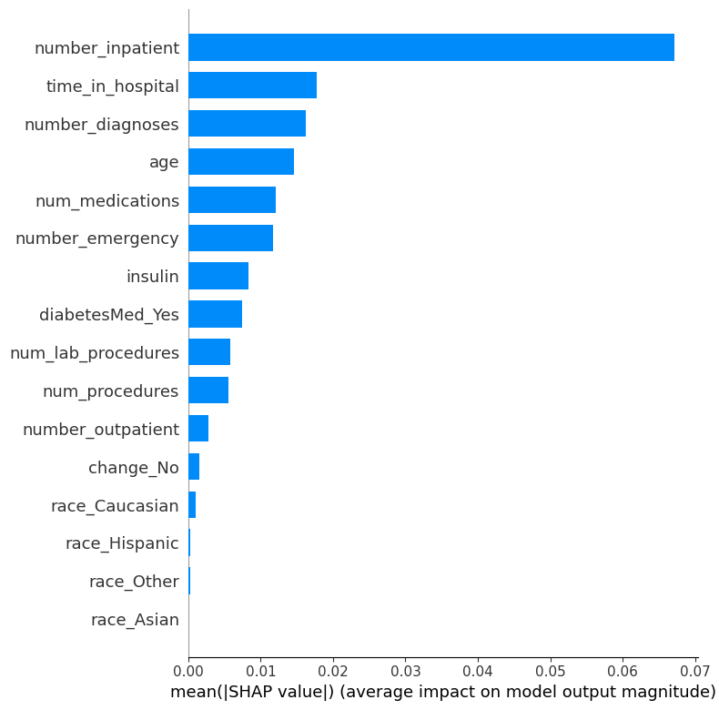
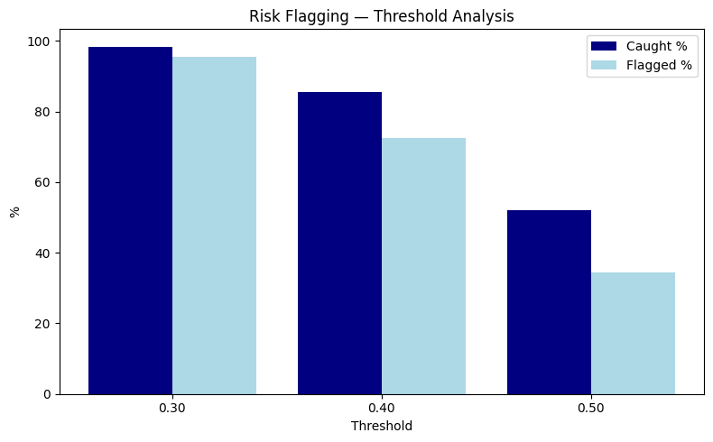

  <h1>Clinical Risk Audit: Mitigating HRRP Financial Penalties</h1>
  
<strong>Healthcare Analytics &nbsp;|&nbsp; 101,766 Patient Encounters &nbsp;|&nbsp; Analytical Insight + Machine Learning</strong>

## Background
Under the Hospital Readmissions Reduction Program (HRRP), Hospitals face direct finanacial penalties for execissive 30-day readmissions. For diabetic patients — a population already at elevated risk for serious long-term complications — an early readmission is not just a cost event. It signals a failure somewhere in the discharge process: rushed planning, poor follow-up coordination, or a clinical picture that was more complex than the encounter data captured.

The Objective: Identify high-risk "Penalty Clusters" before discharge so the hospitals can deploy targeted interventions (follow-ups, pharmacist reviews) to improve patient outcomes but also avoid financial penalty events.

## Executive Summary
Across 130 US Hospotals, 11% of diabetic patients encounters result in early readmission - potentially leading to an overall early readmission rate that the HRRP penalizes hospitals for exceeding. The dominant driver is not diagnosis complexity but rather the amount of times has the patient been admitted before. 

Readmission rates climb from 8% for patients with no prior admissions to 44% for patients with 8 or more - a 5.5x increase confirmed by both SQL exploration and SHAP feature importantce analysis. A tuned Random Forest model catches 85% of actual early readmissions at a 0.40 probability threshold, providing enough signal to flag high-risk patients for enhanced discharge care. The model does not replace clinincal judgment but provides a structured tool for better patient profile flagging.

## Business Problem
Clinical staff operating under heavy caseloads face a consistent problem: not every patient who needs enhanced discharge planning receives it, leading to patients having to be readmitted. The financial stakes are direct. Under HRRP, hospitals with excessive readmission rates for high-risk populations including diabetic patients face Medicare payment reductions. Beyond the penalty, each early readmission represents additional resource consumption, extended staff burden, and a worsened patient outcome.
The aim of this analysis: build a flagging system using clinical encounter data that identifies high-risk patients before discharge — giving discharge planning teams a decision-support tool, not a decision replacement.

## Who Is At Risk?
 
Before modeling, SQL exploration across 101,766 encounters surfaced two distinct high-risk profiles. These are not statistical edge cases — they represent a meaningful share of the patient population.
 
### Profile 1 — Older Patients With Repeat Admissions on Insulin
 
| Attribute | Value |
|---|---|
| Age band | 60–80 |
| Prior inpatient visits | 3+ |
| Medication status | Insulin-dependent |
| Readmission rate | 20–28% |
 
This profile is the most clinically intuitive. High prior admission counts signal chronic instability — patients whose conditions are not being adequately managed between encounters. Insulin dependence adds complexity to discharge coordination. When both conditions are present, readmission rates climb well above the 11% baseline.

### Profile 2 — Young Adults With Unexplained Elevated Risk
 
| Attribute | Value |
|---|---|
| Age band | 20–30 |
| Readmission rate | 14.2% |
| Explained by clinical features? | No |
 
Young adult diabetic patients get readmitted at 14.2% — above the hospital average — and this elevation is not explained by the clinical features available in the dataset. It is likely driven by factors absent from encounter records: social determinants of health, medication adherence, access to follow-up care, and support systems post-discharge. This profile represents the clearest case for expanded data collection.

## Key Finding — Prior Inpatient Visits Drive Everything
 
The SQL exploration phase, conducted in Databricks across 9 analytical steps, consistently surfaced one variable above all others: prior inpatient visits.
 
| Prior Inpatient Visits | Readmission Rate |
|---|---|
| 0 | 8% |
| 1–2 | ~14% |
| 3–5 | ~28% |
| 6–7 | ~38% |
| 8+ | 44% |
 
This relationship was confirmed independently by SHAP analysis on the trained Random Forest — prior inpatient visits ranked as the dominant feature contribution to individual readmission predictions, ahead of all medication, diagnosis, and demographic variables.
 
**Business implication:** A patient's readmission history is both the most accessible and most predictive variable in the dataset. Hospitals already have this information at the point of discharge. The gap is not data — it is a systematic process for acting on it.
 
## Methodology
1) SQL Exploration (Databricks) — 9-step EDA using CTEs, GROUP BY aggregations, CASE WHEN logic, HAVING filters, and subqueries across 101,766 patient encounters to identify readmission patterns by age, race, medications, diagnoses, insulin usage, and prior inpatient visits

2) Statistical Testing — Chi-Square tests for categorical predictors; Point Biserial Correlation for continuous variables; p < 0.05 significance threshold applied across 16 features

3) Feature Engineering — Ordinal encoding for age and insulin; One-hot encoding for race, diabetesMed, and change; Binary target variable creation

4) Modeling — Logistic Regression baseline with class_weight='balanced' to handle 89/11 class imbalance; GridSearchCV to tune Random Forest (optimal: max_depth=10, min_samples_leaf=50, n_estimators=200)

5) Interpretability — SHAP applied to Random Forest on 1,000-patient sample to rank feature contributions to individual predictions

6) Risk Flagging — Threshold analysis at 0.40 to evaluate clinical tradeoff between recall and precision

## Results and Recommendation

### Key Findings
- Prior inpatient visits are the strongest predictor of early readmission (8% -> 44%) - confirmed by SHAP as the most influential feature
- Two high-risk profiles identified: Older patients (60-80) with multiple prior admissions on insulin show 20-28% readmission rates and young adults (20-30) show elevated rates (14.2%) unexplained by clinical features alone
- Model achieves 64% AUC — below performance for reliable clinical deployment. 

| Threshold | Caught % | Flagged % | Precision % |
|-----------|----------|-----------|-------------|
| 0.30      | 98.4%    | 95.6%     | 11.6% |
| 0.40      | 85.4%    | 72.6%     | 13.3% |
| 0.50      | 52.0%    | 34.3%     | 17.1% |

### Recommendation:
**Stakeholder:** Hospital discharge planning teams and clinical operations leadership

Flag all patients with 2+ prior inpatient visits for enhanced discharge planning — regardless of model output. This rule alone captures the highest risk group and requires no model infrastructure to implement. Use the flagging system as a supporting tool to prompt clinician review, not as a clinical decisive tool.

## Tools & Platform
- **Platform:** Databricks
- **Languages:** SQL, Python
- **Libraries:** Pandas, Numpy, Scikit-learn, scipy, SHAP

## Next Steps & Limitations
Data limitation: The model is constrained by available clinical encounter data. Social determinants of health, medication adherence records, mental health history, and post-discharge follow-up data are absent — these are likely the strongest missing predictors for young adult readmission risk
Model limitation: 64% AUC reflects a feature ceiling, not a modeling failure. GridSearchCV confirmed additional tuning does not meaningfully improve performance
Next model: XGBoost or LightGBM with expanded feature set including social determinants; precision-recall curve analysis to optimize threshold selection for specific hospital resource constraints 

## Project Structure
- `diabetes_readmission_analysis (1).ipynb` — SQL EDA (Databricks)
- `diabetes_readmission_modeling.ipynb` — Statistical testing, ML modeling, SHAP, Risk flagging (Databricks)
