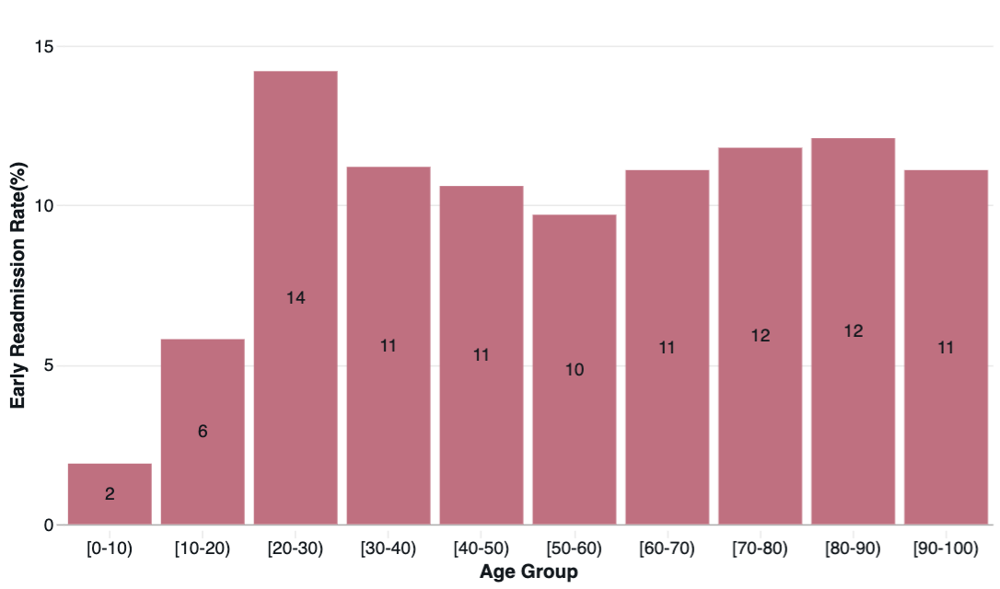
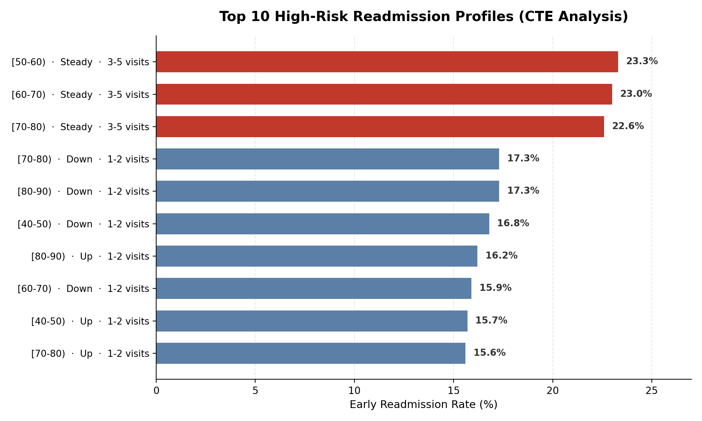
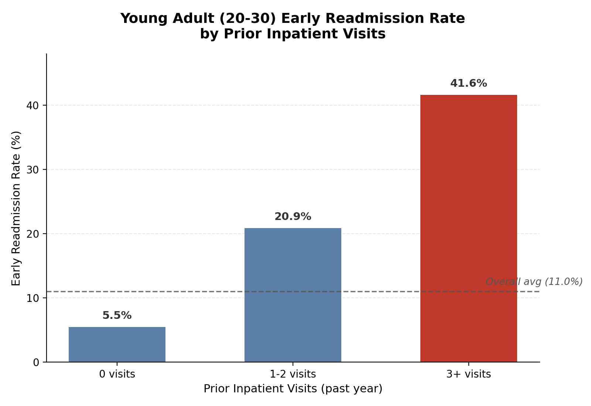
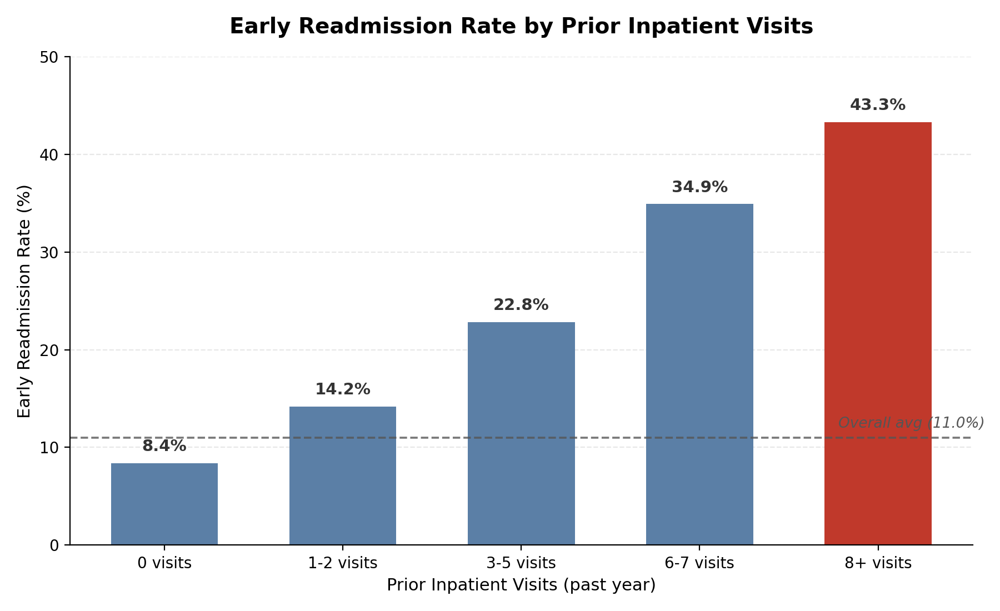

  <h1>Clinical Risk Audit: Mitigating HRRP Financial Penalties</h1>
  
<strong>Healthcare Analytics &nbsp;|&nbsp; 101,766 Patient Encounters &nbsp;|&nbsp; Analytical Insight + Machine Learning</strong>

## Background
Under the Hospital Readmissions Reduction Program (HRRP), Hospitals face direct finanacial penalties for execissive 30-day readmissions. For diabetic patients — a population already at elevated risk for serious long-term complications — an early readmission is not just a cost event. It signals a failure somewhere in the discharge process: rushed planning, poor follow-up coordination, or a clinical picture that was more complex than the encounter data captured.

The Objective: Identify high-risk "Penalty Clusters" before discharge so the hospitals can deploy targeted interventions (follow-ups, pharmacist reviews) to improve patient outcomes but also avoid financial penalty events.

## Executive Summary
Across 130 US hospitals, 11% (2008) of diabetic patient encounters result in early readmission — an overall rate that HRRP penalizes hospitals for exceeding. The dominant driver is not diagnosis complexity but a patient's history of prior hospital admissions.

Readmission rates climb from 8% for patients with no prior admissions to 44% for patients with 8 or more - a 5.5x increase confirmed by both SQL exploration and SHAP feature importantce analysis. This same driver fully explains an initially puzzling signal: young adults (20-30) showed the second-highest readmission rate of any age group, but breaking that group down by prior admission history shows they follow the identical pattern as every other age band — there is no separate, unexplained young-adult risk factor in this dataset. 

A tuned Random Forest model catches 85% of actual early readmissions at a 0.40 probability threshold, providing enough signal to flag high-risk patients for enhanced discharge care. The model does not replace clinincal judgment but provides a structured tool for better patient profile flagging.

## Business Problem
Clinical staff operating under heavy caseloads face a consistent problem: not every patient who needs enhanced discharge planning receives it, leading to patients having to be readmitted. The financial stakes are direct. Under HRRP, hospitals with excessive readmission rates for high-risk populations including diabetic patients face Medicare payment reductions. Beyond the penalty, each early readmission represents additional resource consumption, extended staff burden, and a worsened patient outcome.

The aim of this analysis: build a flagging system using clinical encounter data that identifies high-risk patients before discharge — giving discharge planning teams a decision-support tool, not a decision replacement.

----

<h2>Analysis Phase</h2>

### Age Distribution

Young adults (20-30) showed a surprisingly elevated 14% early readmission rate — higher than every age band except patients over 60. This raised the question addressed below: is age itself a risk factor, or is something else driving this?

### The Penalty Cluster — Steady Insulin, Multiple Prior Admissions

| Attribute | Value |
|---|---|
| Age band | 50–80 |
| Prior inpatient visits |3-5 |
| Medication status | Insulin-dependent, steady dose |
| Readmission rate | 22.6–23.3% |

This is the clearest, most consistent Penalty Cluster in the dataset — the rate holds within a single percentage point across three separate 10-year age bands once insulin status and admission history are fixed, meaning these two factors drive risk more than age does. High prior admission counts signal chronic instability; a steady insulin dose without escalation suggests the current regimen may not be adequately controlling the condition between encounters.

### Resolving the Young-Adult Question

The age-group elevation seen above is not a separate, unexplained risk factor — it's the same driver at work in a smaller population. Breaking young adults down by prior inpatient visits shows an identical escalating pattern to the rest of the dataset:

| Prior Inpatient Visits | Readmission Rate |
|---|---|
| 0 visits | 5.5% |
| 1-2 visits | 20.9% |
| 3+ visits | 41.6% |

Young adults with no admission history are actually below the hospital's overall average. The elevated group-wide rate is driven entirely by the smaller subset with repeat admissions — the same signal that explains risk everywhere else in this population. There is no distinct young-adult risk category requiring separate data collection; the existing signal already covers it.

## Key Finding — Prior Inpatient Visits Drive Everything

The SQL exploration phase, conducted in Databricks, consistently surfaced one variable above all others: prior inpatient visits.

| Prior Inpatient Visits | Readmission Rate |
|---|---|
| 0 | 8.4% |
| 1–2 | 14.2% |
| 3–5 | 22.8% |
| 6–7 | 34.9% |
| 8+ | 43.3% |

This relationship was confirmed independently by SHAP analysis on the trained Random Forest — prior inpatient visits ranked as the dominant feature contribution to individual readmission predictions, ahead of all medication, diagnosis, and demographic variables. It also holds true within the young-adult subgroup above, confirming it as a universal driver rather than one specific to older patients.

**Business implication:** A patient's readmission history is both the most accessible and most predictive variable in the dataset. Hospitals already have this information at the point of discharge. The gap is not data — it is a systematic process for acting on it.

## Results and Recommendation

### Key Findings
- Prior inpatient visits are the strongest predictor of early readmission (8% → 44%) — confirmed by SHAP as the most influential feature, and consistent across every age group including young adults
- One dominant Penalty Cluster identified: patients aged 50-80 on a steady insulin dose with 3-5 prior admissions (22.6-23.3% readmission rate)
- Model achieves 64% AUC — below performance for reliable clinical deployment

### Recommendation:
**Stakeholder:** Hospital discharge planning teams and clinical operations leadership

Flag all patients with 2+ prior inpatient visits for enhanced discharge planning — regardless of age or model output. This single rule captures the highest-risk population across every age group and requires no model infrastructure to implement. Use the flagging system as a supporting tool to prompt clinician review, not as a clinical decisive tool.

 
 
## Methodology
1) SQL Exploration (Databricks) — 9-step EDA using CTEs, GROUP BY aggregations, CASE WHEN logic, HAVING filters, and subqueries across 101,766 patient encounters to identify readmission patterns by age, race, medications, diagnoses, insulin usage, and prior inpatient visits

2) Statistical Testing — Chi-Square tests for categorical predictors; Point Biserial Correlation for continuous variables; p < 0.05 significance threshold applied across 16 features

3) Feature Engineering — Ordinal encoding for age and insulin; One-hot encoding for race, diabetesMed, and change; Binary target variable creation

4) Modeling — Logistic Regression baseline with class_weight='balanced' to handle 89/11 class imbalance; GridSearchCV to tune Random Forest (optimal: max_depth=10, min_samples_leaf=50, n_estimators=200)

5) Interpretability — SHAP applied to Random Forest on 1,000-patient sample to rank feature contributions to individual predictions

6) Risk Flagging — Threshold analysis at 0.40 to evaluate clinical tradeoff between recall and precision

---

<h2>Modeling Phase (Machine Learning)</h2>

### Key Findings
- Prior inpatient visits are the strongest predictor of early readmission (8% -> 44%) - confirmed by SHAP as the most influential feature
- Two high-risk profiles identified: Older patients (60-80) with multiple prior admissions on insulin show 20-28% readmission rates and young adults (20-30) show elevated rates (14.2%) unexplained by clinical features alone
- Model achieves 64% AUC — below performance for reliable clinical deployment. 

| Threshold | Caught % | Flagged % | Precision % |
|-----------|----------|-----------|-------------|
| 0.30      | 98.4%    | 95.6%     | 11.6% |
| 0.40      | 85.4%    | 72.6%     | 13.3% |
| 0.50      | 52.0%    | 34.3%     | 17.1% |

### Recommendation:
**Stakeholder:** Hospital discharge planning teams and clinical operations leadership

Flag all patients with 2+ prior inpatient visits for enhanced discharge planning — regardless of model output. This rule alone captures the highest risk group and requires no model infrastructure to implement. Use the flagging system as a supporting tool to prompt clinician review, not as a clinical decisive tool.

## Next Steps & Limitations
Data limitation: The model is constrained by available clinical encounter data. Social determinants of health, medication adherence records, mental health history, and post-discharge follow-up data are absent from this dataset entirely.
Model limitation: 64% AUC reflects a feature ceiling, not a modeling failure. GridSearchCV confirmed additional tuning does not meaningfully improve performance.
Next model: XGBoost or LightGBM with expanded feature set including social determinants; precision-recall curve analysis to optimize threshold selection for specific hospital resource constraints.

## Tools & Platform
- **Platform:** Databricks
- **Languages:** SQL, Python
- **Libraries:** Pandas, Numpy, Scikit-learn, scipy, SHAP

## Project Structure
- `clinical_diabetes_EDA.ipynb` — SQL EDA (Databricks)
- `diabetes_readmission_modeling.ipynb` — Statistical testing, ML modeling, SHAP, Risk flagging (Databricks)

